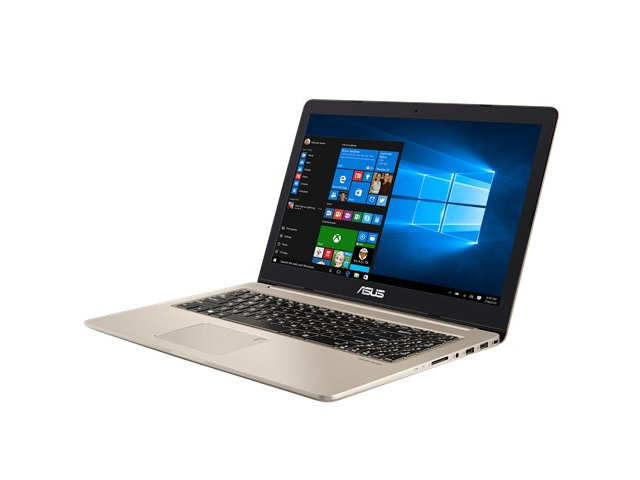
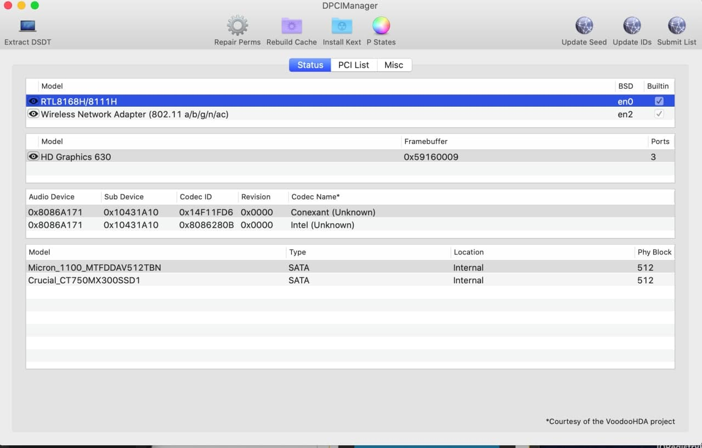
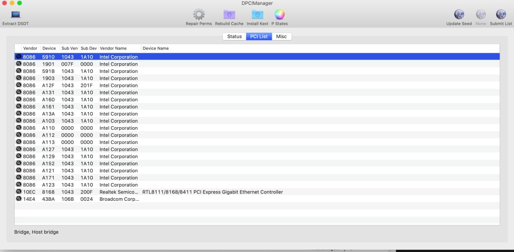
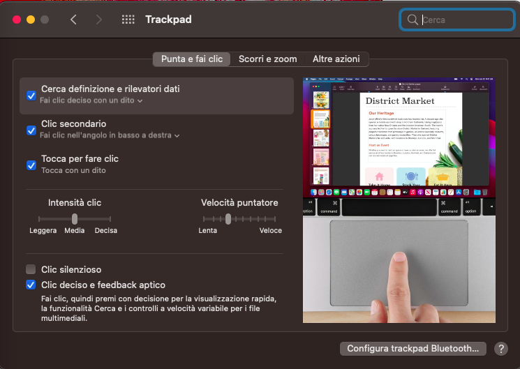

# Asus Vivobook Pro N580VD

## Computer Spec:

| Component          | Brank                               |
| ------------------ | ----------------------------------  |
| CPU                | Intel® i7 7700HQ (KL)               |
| IGPU               | Intel® HD Graphics 630              |
| dGPU               | Nvidia 1050 GTX (disabled on macOs) |
| Display            | 1920x1080                           |
| Audio              | Conexant Audio CX8150               |
| Ram                | 32GB                                |
| SSD                | Kingstone A400 128gb                |
| SmBios             | MacbookPro 14,3                     |
| BootLoader         | OpenCore                            |

### BIOS SETTINGS:

- BIOS VER: 315
- Secureboot: Disabled
- Fastboot: Disabled
- CSM Support: Disabled
- Legacy USB Support: Disabled
- Sata mode: AHCI
- DVMT Pre-Allocated: 64M

### DCPIManager

### Trackpad

# If you need help please contact us on [Telegram](https://t.me/HackintoshLife_it) or [Web](https://www.hackintoshlife.it/)
