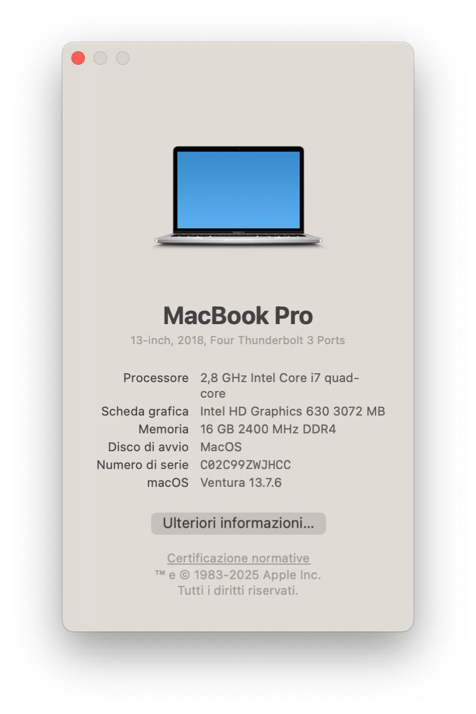
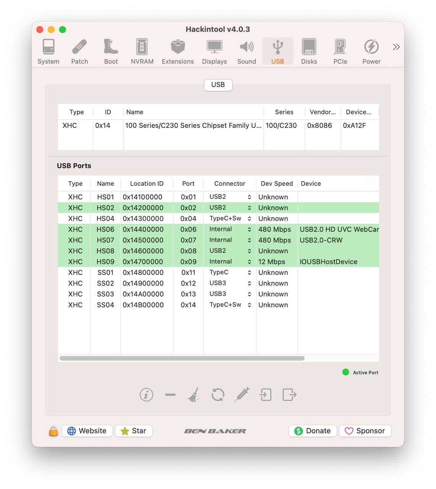

# Asus Vivobook Pro N580VD

## Computer Spec:

| Component          | Brank                                         |
| ------------------ | --------------------------------------------- |
| CPU                | Intel® i7 7700HQ (KL)                         |
| IGPU               | Intel® HD Graphics 630                        |
| dGPU               | Nvidia 1050 GTX (disabled on macOs)           |
| Display            | 4K - 3840 x 2160 (Scaled to 1080P)            |
| Audio              | Conexant Audio CX8150                         |
| Ram                | 16GB RAM DDR4 PC19200 / 2400Mhz               |
| SSD                | 1x Micron 1100 SSD 256GB + 1x Toshiba HDD 1TB |
| Touchpad           | ELAN ELAN1200 I2C Interface                   |
| Wifi               | Intel AC 8265 and Bluetooth                   |
| Ethernet           | Realtek RTL8168 Gigabit Ethernet              |
| SmBios             | MacBookPro 15,2                               |

### BIOS SETTINGS:

- BIOS VER: 317
- Secureboot: Disabled
- Fastboot: Disabled
- CSM Support: Disabled
- Legacy USB Support: Disabled
- Sata mode: AHCI
- DVMT Pre-Allocated: 64M
  

### DCPIManager

### USB

### Trackpad

### Output Video

# If you need help please contact us on [Telegram](https://t.me/HackintoshLife_it) or [Web](https://www.hackintoshlife.it/)
